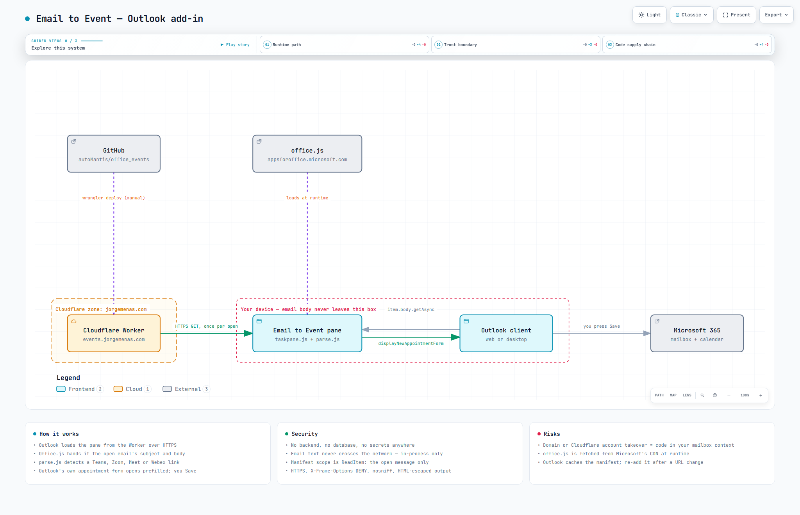

# Email to Event — Outlook add-in

Open an email, press one button, get a calendar appointment with the subject, the meeting
link and the body already filled in. You add the attendees and press Save.

**Live at [events.jorgemenas.com](https://events.jorgemenas.com)** — nothing runs on your
machine, and there is no server to keep awake.

---

## Install (about two minutes)

1. Go to <https://events.jorgemenas.com> and download [`manifest.xml`](https://events.jorgemenas.com/manifest.xml).
2. In Outlook, open the add-in dialog:
   - **Outlook on the web / new Outlook:** Settings (gear) → **General** → **Manage add-ins** → **My add-ins**
   - **Classic Outlook desktop:** **Get Add-ins** on the ribbon → **My add-ins**
3. Choose **Add a custom add-in** → **Add from file**, pick the `manifest.xml` you downloaded, confirm.
4. Open any email. A **Email to Event** button appears on the ribbon.

To remove it, go back to **My add-ins** and delete it. Nothing is left behind.

## Using it

Click **Email to Event** on an open email. A pane opens on the right with:

| Field | Filled with |
|---|---|
| Subject | The email's subject |
| Location | `Microsoft Teams Meeting`, or the meeting URL, or empty |
| Start | The next `:00` or `:30` |
| Duration | 30 minutes (pick 15 min to 2 hours) |
| Description preview | The email body, trimmed to 2000 characters |

A badge tells you whether a meeting link was found. Press **Create appointment** and
Outlook's own appointment form opens, already filled in. Add your attendees and save it
the way you always do.

### What it does with meeting links

| The email contains | Location becomes | Body gets |
|---|---|---|
| A Teams join link | `Microsoft Teams Meeting` | The join link at the top, then the email body |
| Zoom, Google Meet, Webex, GoTo or Whereby | The link itself | The join link at the top, then the email body |
| No link | empty | The email body |

---

## How it works

<picture>
  <source media="(prefers-color-scheme: dark)" srcset="docs/architecture-dark.png">
  
</picture>

*Interactive version: [docs/architecture.html](docs/architecture.html) — or open it live at
[events.jorgemenas.com/docs/architecture.html](https://events.jorgemenas.com/docs/architecture.html).*

The whole add-in is four files of static content. There is no server, no database and no
API of any kind behind it:

1. Outlook loads `taskpane.html` from the Cloudflare Worker over HTTPS. This is the only
   network request the add-in causes, and it happens once, when you open the pane.
2. `office.js`, Microsoft's add-in library, loads from Microsoft's CDN. The Office add-in
   model requires this and it cannot be self-hosted.
3. Office.js hands the pane the open message's subject and body **in-process** — the text
   moves inside the Outlook process on your own machine. It is not fetched, posted or
   proxied anywhere.
4. `parse.js` scans that text for a meeting link and assembles the appointment fields.
   It is pure string handling with no network access, which is why it can be unit-tested
   with plain `node test-parse.js`.
5. The pane calls `displayNewAppointmentForm()`, which is Outlook opening its own
   appointment window, prefilled. The add-in never writes to your calendar itself.
6. You press Save. From there it is ordinary Outlook behaviour.

## Security

| Property | Why it holds |
|---|---|
| **No backend** | The Cloudflare Worker has no `main` entry — it only serves files. There is no code path that can receive, log or store a request body. |
| **No secrets** | The repository contains no API keys, tokens or credentials, and the add-in never authenticates to anything. That is why it is safe to make this repo public. |
| **Your email stays on your device** | Subject and body reach the pane through Office.js inside the Outlook process. Nothing in `taskpane.js` or `parse.js` calls `fetch`, `XMLHttpRequest` or any other network API. |
| **Minimal permission scope** | The manifest requests `ReadItem` — read the message you currently have open. It cannot read other emails, cannot send mail, and cannot write your calendar without you confirming the appointment form. |
| **Output is escaped** | `parse.js` escapes `&`, `<` and `>` before building the appointment body, so a crafted email cannot inject markup into the event. |
| **Transport and headers** | HTTPS is enforced by Cloudflare, with `X-Frame-Options: DENY`, `X-Content-Type-Options: nosniff` and `Referrer-Policy: strict-origin-when-cross-origin` on every response. |

### Risks worth knowing

These are real and worth understanding before you install it — or any Outlook add-in.

- **Whoever controls the domain controls the code.** A task pane runs code served from a
  URL. If the `jorgemenas.com` zone or the Cloudflare account behind it were taken over,
  the attacker could serve different JavaScript that runs with `ReadItem` access to
  whatever message you have open. This is inherent to every hosted add-in, not specific
  to this one. The mitigation is account hygiene: MFA on the Cloudflare account and on
  the registrar.
- **`office.js` is a third-party runtime dependency.** It is fetched from
  `appsforoffice.microsoft.com` each time the pane opens. You are trusting Microsoft's CDN,
  which you already do by using Outlook.
- **The pane URL is public.** Anyone can open <https://events.jorgemenas.com/taskpane.html>
  in a browser. It returns nothing useful — outside an Outlook host there is no mailbox
  context for Office.js to read, so the page just sits there.
- **Outlook caches the manifest.** If the hosting URL ever changes, remove the add-in from
  *My add-ins* and re-add it, or Outlook will keep pointing at the old location.
- **Review it yourself.** The entire add-in is about 200 lines across `taskpane.js` and
  `parse.js`. Reading them takes a few minutes, and that is a better guarantee than
  anything written on this page.

### Known limits

- Office.js cannot flip the **Teams meeting** toggle on the appointment form. A Teams link
  is put in the body and the location reads `Microsoft Teams Meeting`; clicking the link
  joins. For a real Teams-organised meeting, toggle it yourself in the form and Outlook
  adds its own link.
- No date or time is parsed out of the email text. This is deliberate — "call me at 5"
  produces more wrong appointments than right ones, so you pick the slot instead.
- Requires Mailbox requirement set 1.5 or later.

---

## Files

| File | What |
|---|---|
| `manifest.xml` | The add-in manifest (XML format — works on classic desktop Outlook and on the web) |
| `taskpane.html` / `taskpane.js` | The pane UI and the Office.js glue |
| `parse.js` | Link detection and body building. No Office.js, so it is unit-testable |
| `test-parse.js` | `node test-parse.js` — the only test |
| `index.html` | The install page served at the site root |
| `wrangler.jsonc` | Cloudflare Workers config (static assets, no server code) |
| `_headers` | Security and cache headers |
| `docs/` | Architecture diagram: spec, interactive HTML, and the images above |

## Local development

```bash
npm install
npm run certs
npm start
```

Open <https://localhost:3000/taskpane.html> once in a browser and accept the certificate if
prompted. To sideload the local version, copy `manifest.xml`, point the copied file's URLs
at `localhost:3000`, and sideload that copy — leave the committed manifest pinned to
production.

```bash
npm test
```

## Deploying

Pushing to GitHub does not deploy. Deploys are a deliberate manual step:

```bash
npx wrangler deploy
```

`wrangler.jsonc` publishes the repository root as Cloudflare Workers static assets, with no
`main` key, so there is no Worker code and no per-request billing. The custom domain is
attached through the `routes` entry in the same file.

To regenerate the architecture diagram after changing `docs/architecture.json`:

```bash
archify deliver architecture docs/architecture.json docs/architecture.html --quality showcase
```

## Troubleshooting

**"Add-in Error — something went wrong and we couldn't start this add-in"**

1. Does <https://events.jorgemenas.com/taskpane.html> load in a browser? If not, redeploy.
2. Remove the add-in from *My add-ins* and sideload `manifest.xml` again — Outlook caches
   manifests aggressively.

**The button does not appear on the ribbon.** The add-in only activates on a message you
are reading. It does not appear on compose windows or on calendar items.
